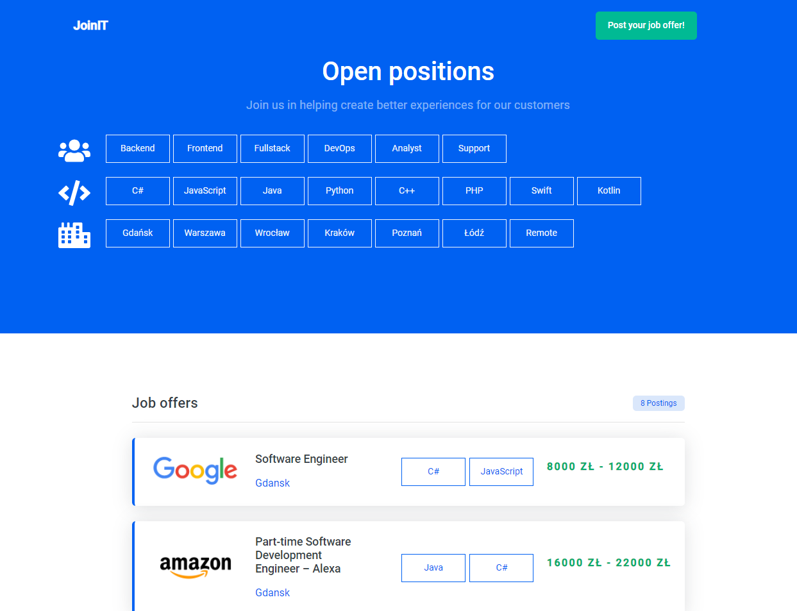
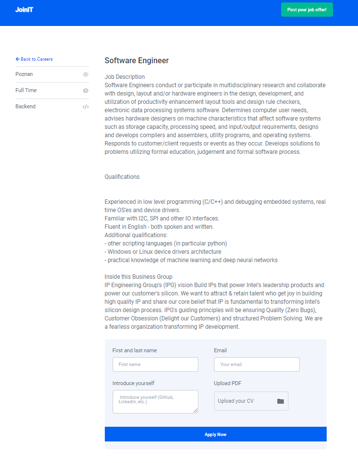
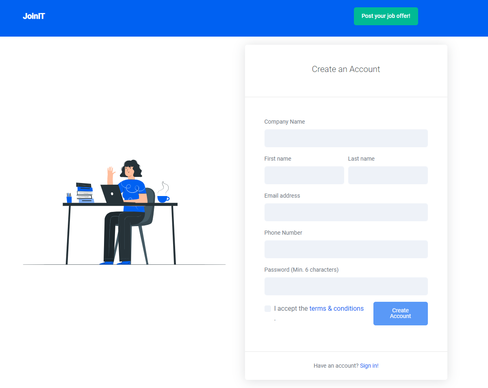
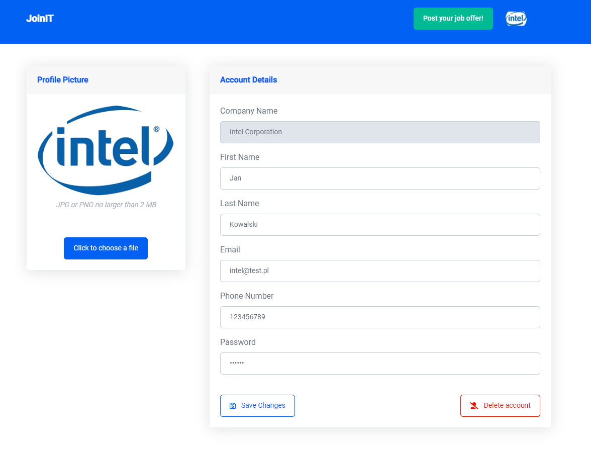
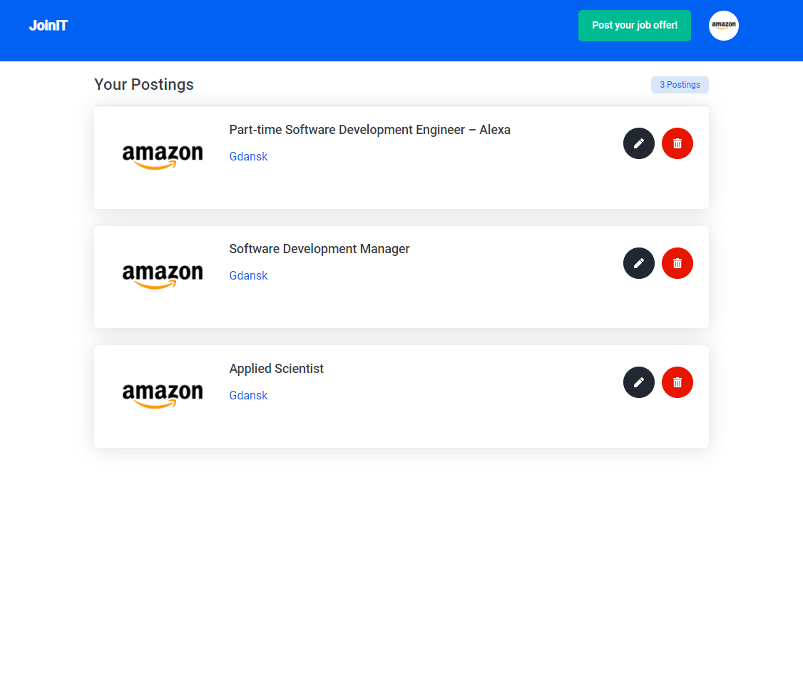
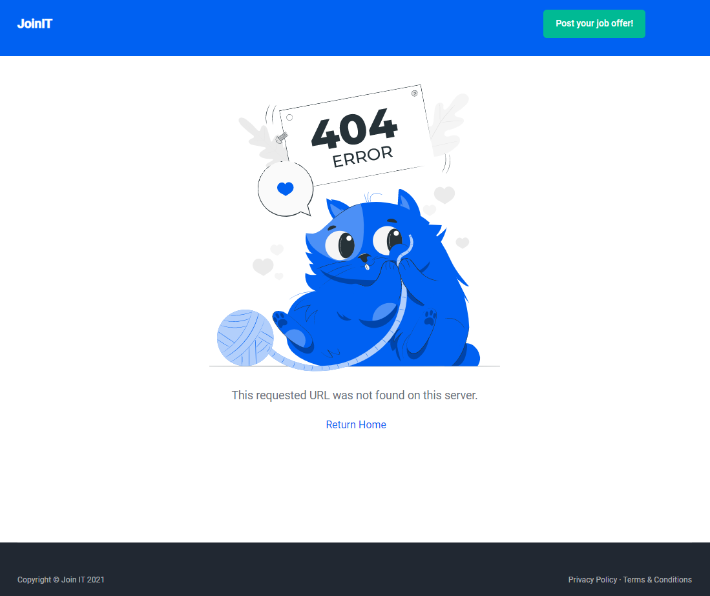

# JoinIt-JobBoard

<!-- TABLE OF CONTENTS -->
## Table of Contents

* [About the Project](#about-the-project)
  * [Built With](#built-with)
  * [Functionality description](#functionality-description)
* [Screenshots from JoinIt](#screenshots-from-joinit)

<!-- ABOUT THE PROJECT -->
## About The Project
Job board for IT Industry. It was built with Java on backend part and Angular on frontend part of the application.

### Built With
* Java
* Spring Boot
* Hibernate
* JPA
* Angular
* ngx-spinner
* ngx-toastr
* rxjs 
* Azure App Service

### Functionality description
JoinIt job board allows everyone to look through all posted job offers. Users are also able to search for postings by category, requirements and localization. If the user clicks on an offer, he/she will go to the detailed view of the chosen posting. If user will find the posting that he/she is looking for, JoinIt allows everyone to apply for posting directly through our site. As soon as user completes the application form and click Apply Now button, company, that had posted this offer, will instantly receive an email with this application and CV as an attachment. Our users will also receive confirmation email, with informations for which job offer they just applied for and with all the data that they sent.

JoinIt allows companies to set up their accounts and then edit or completely delete their profile. Authenticated users are able to create their job postings for other users to apply for. They will also have an option to see the list of all postings that they had created and from there, companies users will be able to edit or delete their postings.

## Screenshots from JoinIt

<h5 align="center"> Main Board </h5>

  

<h5 align="center"> Postings </h5>

  

  

  

<h5 align="center"> Account Views </h5>

  

  

  

<h5 align="center"> 404 View </h5>

  

